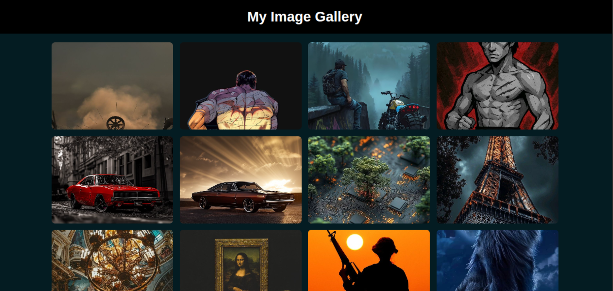

---

# 🖼️ Simple Image Gallery

A responsive and interactive image gallery with a lightbox feature, built using **HTML**, **CSS**, and **JavaScript**.

## 🚀 Features

* 📸 Responsive image grid layout
* 💡 Lightbox view for full-size images
* ➡️ Previous/Next navigation in lightbox
* ✖️ Close lightbox by clicking outside or pressing `Esc`
* ⌨️ Keyboard navigation support (← → Esc)
* 📱 Mobile-friendly design

## 🧰 Technologies Used

* HTML5
* CSS3 (including media queries for responsiveness)
* JavaScript 

## 📂 Project Structure

```
/project-root
│
├── index.html       # Main HTML file
├── styles.css       # CSS styles for gallery and lightbox
├── script.js        # JavaScript for interactivity
└── README.md        # Project documentation
```

## 🔧 How to Use

1. **Clone the repository:**

   ```bash
   git clone https://github.com/yourusername/simple-image-gallery.git
   ```

2. **Open `index.html` in your browser.**

That's it! The gallery will display the images and enable lightbox functionality.

> 💡 You can replace the placeholder image URLs in `index.html` with your own image links or local image paths.

## 🖼️ Adding Your Own Images

Replace the `` tags inside the `.gallery` div in `index.html`:

```html

```

## 📸 Screenshot



